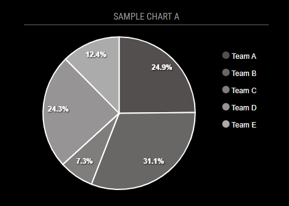
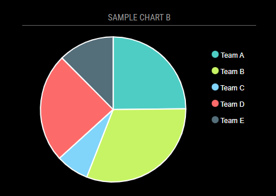
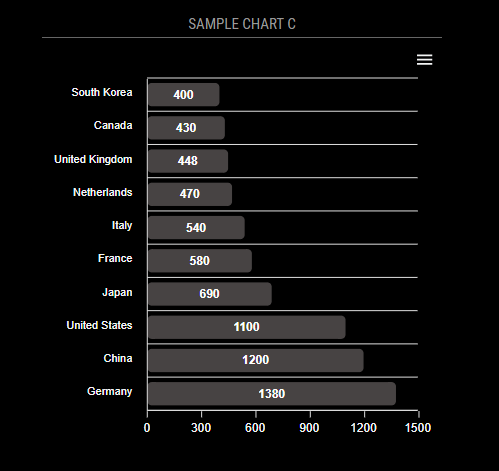
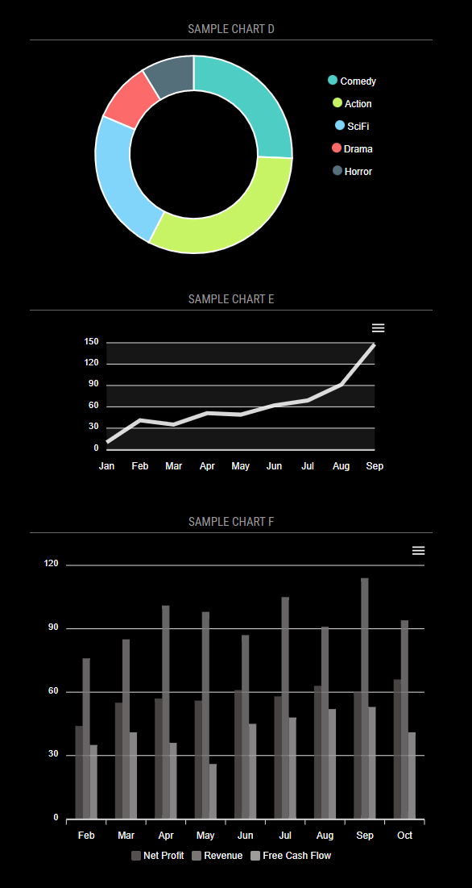

# MMM-ApexCharts
Chart module using [ApexCharts.js](https://apexcharts.com/) for [MagicMirror²](https://github.com/MichMich/MagicMirror).

Chart data can be supplied in config or pulled from JSON api.  Currently the data is only retrieved once.  I'll be adding interval update soon.

##

## Installation

In your terminal, go to your MagicMirror's Module folder:
````
cd ~/MagicMirror/modules
````

Clone this repository:
````
git clone https://github.com/sharmst/MMM-ApexCharts.git
````

Install dependencies:
````
cd ~/MagicMirror/modules/MMM-ApexCharts
````

````
npm install
````

Configure the module in your `config.js` file.

## Usage

To use this module, add it to the modules array in the `config/config.js` file:
````javascript
{
  module: 'MMM-ApexCharts',
	config: {
	    // See 'Configuration options' for more information.
	}
}
````

## Configuration options

The following options can be configured:

| Option      | Description             | Default value |
| ------------|-------------------------|:-------------:|
| chartBackground       | Chart background color.      | ```transparent```     |
| chartDataLabels       | Display data lables.      | ```true```     |
| chartHeight      | Chart height in px.     | ```400```     |
| chartID      | ID assigned to chart. Allows for multiple charts.     | ```1```     |
| chartJsonSeriesFormat       | JSON format of chart data.      | ```single```     |
| chartJsonUrl       | URL to fetch JSON data.      | ```null```     |
| chartMonochrome       | Use monochrome color palette.      | ```true```     |
| chartMonochromeColor       | Base color for generating shades.      | ```#534F4F```     |
| chartThemeMode       | Color theme.  Dark or Light.      | ```dark```     |
| chartWidth       | Chart width in px.      | ```400```     |
| chartConfig | ApexChart.js config. More info at [apexcharts.js](https://apexcharts.com/) | ```{}``` |

## Examples

Pie chart with default options:
````javascript
{
  module: "MMM-ApexCharts",
  position: "top_center",
  header: "Sample Chart A",
  config: {
    chartConfig: {
      chart: {
        type: 'pie'
      },
      series: [44, 55, 13, 43, 22],
      labels: ['Team A', 'Team B', 'Team C', 'Team D', 'Team E']
     }
  }
}
````


Same pie chart with custom options:
````javascript
{
  module: "MMM-ApexCharts",
  position: "top_center",
  header: "Sample Chart B",
  config: {
    chartMonochrome: false,  // Disabled monochrome coloring
    chartDataLabels: false,  // Removed data point lables
    chartConfig: {
    chart: {
      type: 'pie'
    },
    series: [44, 55, 13, 43, 22],
      labels: ['Team A', 'Team B', 'Team C', 'Team D', 'Team E']
     }
  }
}
````


Bar chart with default options:
````javascript
{
  module: "MMM-ApexCharts",
  position: "top_center",
  header: "Sample Chart C",
  config: {
    chartConfig: {       
      chart: {
        type: 'bar'
      },
      series: [{
        data: [400, 430, 448, 470, 540, 580, 690, 1100, 1200, 1380]
      }],
      plotOptions: {
        bar: {
          borderRadius: 4,
          horizontal: true,
        }
      },
      xaxis: {
        categories: ['South Korea', 'Canada', 'United Kingdom', 'Netherlands', 'Italy', 'France', 'Japan',
          'United States', 'China', 'Germany'
        ],
      }
    }
  }
}
````


Multiple charts on mirror.  The important thing to note here is the unique chartID option for each chart.
````javascript
{
  module: "MMM-ApexCharts",
  position: "top_center",
  header: "Sample Chart D",
  config: {
    chartID: 1,  // Important when more than one chart
    chartMonochrome: false,
    chartDataLabels: false,
    chartConfig: {
      chart: {
        type: 'donut'
      },
      series: [44, 55, 41, 17, 15],
      labels: ["Comedy", "Action", "SciFi", "Drama", "Horror"]
    }
  }
},
{
  module: "MMM-ApexCharts",
  position: "top_center",
  header: "Sample Chart E",
  config: {
    chartDataLabels: false,
    chartHeight: 200,
    chartID: 2, // Important when more than one chart
    chartMonochromeColor: '#ffffff',
    chartConfig: {          
      series: [{
        name: "Desktops",
        data: [10, 41, 35, 51, 49, 62, 69, 91, 148]
      }],
      chart: {
        type: 'line',
        zoom: {
          enabled: false
        }
      },
      grid: {
        row: {
          colors: ['#dddddd', 'transparent'], // takes an array which will be repeated on columns
          opacity: 0.1
        },
      },
      xaxis: {
        categories: ['Jan', 'Feb', 'Mar', 'Apr', 'May', 'Jun', 'Jul', 'Aug', 'Sep'],
      }          
    }
  }
},
{
  module: "MMM-ApexCharts",
  position: "top_center",
  header: "Sample Chart F",
  config: {
    chartID: 3, // Important when more than one chart
    chartDataLabels: false,
    chartWidth: 500,
    chartConfig: {
      chart: {
        type: 'bar'
      },
      plotOptions: {
        bar: {
          horizontal: false,
          columnWidth: '55%',
          endingShape: 'rounded'
        }
      },
      series: [{
        name: 'Net Profit',
        data: [44, 55, 57, 56, 61, 58, 63, 60, 66]
      }, {
        name: 'Revenue',
        data: [76, 85, 101, 98, 87, 105, 91, 114, 94]
      }, {
        name: 'Free Cash Flow',
        data: [35, 41, 36, 26, 45, 48, 52, 53, 41]
      }],
      xaxis: {
        categories: ['Feb', 'Mar', 'Apr', 'May', 'Jun', 'Jul', 'Aug', 'Sep', 'Oct'],
      },
    }
  }
}
````


Fetching chart data from JSON API
````javascript
{
  module: "MMM-ApexCharts",
  position: "top_center",
  header: "Sample Chart JSON",
  config: {
    chartID: 2,  // Important when more than one chart
    chartDataLabels: false,
    chartJsonSeriesFormat: 'single',
    chartJsonUrl: 'http://my-json-server.typicode.com/apexcharts/apexcharts.js/yearly',
    chartMonochromeColor: '#ffffff',
    chartConfig: {
      chart: {
        type: 'bar',
        zoom: {
          enabled: false,
        }
      },
      series: [],
      noData: {
        text: 'Loading...'
      },
      xaxis: {
        type: 'category',
        tickPlacement: 'on',
        labels: {
          rotate: -45,
          rotateAlways: true
        }
      }
    }
  }
}
````


