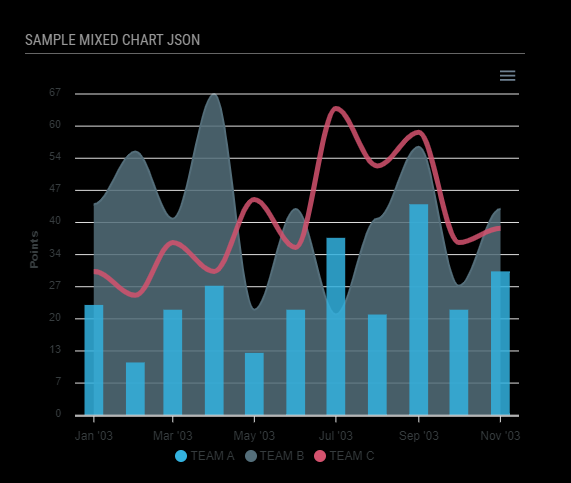

# MMM-ApexCharts
Chart module using [ApexCharts.js](https://apexcharts.com/) for [MagicMirror²](https://github.com/MichMich/MagicMirror).

Chart data can be supplied in config or pulled from JSON api.  Currently the data is only retrieved once.  I'll be adding interval update soon.

##

## Installation

In your terminal, go to your MagicMirror's Module folder:
````
cd ~/MagicMirror/modules
````

Clone this repository:
````
git clone https://github.com/sharmst/MMM-ApexCharts.git
````

Install dependencies:
````
cd ~/MagicMirror/modules/MMM-ApexCharts
````

````
npm install
````

Configure the module in your `config.js` file.

## Usage

To use this module, add it to the modules array in the `config/config.js` file:
````javascript
{
  module: 'MMM-ApexCharts',
	config: {
	    // See 'Configuration options' for more information.
	}
}
````

## Configuration options

The following options can be configured:

| Option      | Description             | Default value | Required |
| ------------|-------------------------|-------------|:-------------:|
| chartBackground | Chart background color. | ```transparent``` | No |
| chartDataLabels | Display data lables.  | ```true```  |  No |
| chartHeight | Chart height in px. | ```400``` | No |
| chartID | ID assigned to chart. Allows for multiple charts. | ```1``` | Yes when multiple charts are defined. |
| chartJsonFormat | JSON format of chart data. paired, labels or categories | ```paired```  | See JSON usage notes  |
| chartJsonInterval | How often to update JSON chart data in milliseconds.  | ```null```  | Yes when JSON data needs to be updated. |
| chartJsonLabelCatName  | Key name that holds labels or categories. | ```labels```  | No |
| chartJsonSeriesName  | Key name that holds series data. | ```null```  | No |
| chartJsonUrl  | URL to fetch JSON data. | ```null```  | Yes when data is fetched from Json API |
| chartMonochrome | Use monochrome color palette. | ```true```  | No |
| chartMonochromeColor  | Base color for generating shades. | ```#534F4F``` | No |
| chartThemeMode  | Color theme.  Dark or Light.  | ```dark```  | No |
| chartThemePalette  | Color palette.  palette1 to palette10  | ```palette1```  | No |
| chartWidth  | Chart width in px.  | ```400``` | No |
| chartConfig | ApexChart.js config. More info at [apexcharts.js](https://apexcharts.com/) | ```{}``` |

## JSON Usage Notes

- If the chartInterval option is not set in your config, the chart will only fetch the JSON data at startup.

- *chartJsonFormat* options explained:
*paried:* Data is in a two dimensional array where the 1st index is the x axes value and the 2nd index is the y axes value. The x value can be numeric or a category.  Examples of json structures and options :

````
// numeric
[{
  [1, 34], [3, 54], [5, 23], [15, 43]
}]
````
chartJsonFormat: "paired"
chartJsonSeriesName: not required
chartJsonLabelCatName: not required


````
// category
"fruit": [{
    x: 'Apple',
    y: 54
}, {
    x: 'Orange',
    y: 66
}]
````
chartJsonFormat: "paired"
chartJsonSeriesName: "fruit"
chartJsonLabelCatName: not required


*labels* and *categories*: Chart requires either "labels" defined in chart options or "categories" in x-axis options.  Example of json structure and options:
````
{
  "series": [23, 11, 54, 72, 12],
  "fruits": ["Apple", "Mango", "Banana", "Papaya", "Orange"]
}
 
````
chartJsonFormat: "labels" or "categories"
chartJsonSeriesName: "series"
chartJsonLabelCatName: "fruits"


There are several examples in the wiki

## Screenshots

Pie chart:


Same pie chart with custom options:


Bar chart with default options:


Mixed chart with color palette option:



Multiple charts on mirror: 


